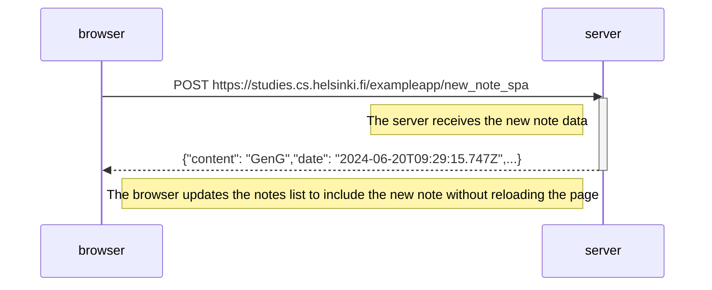

```mermaid
sequenceDiagram
    participant browser
    participant server

    browser->>server: POST https://studies.cs.helsinki.fi/exampleapp/new_note_spa
    activate server
    Note left of server: The server receives the new note data
    server-->>browser: {"content": "GenG","date": "2024-06-20T09:29:15.747Z",...}
    deactivate server
    Note right of browser: The browser updates the notes list to include the new note without reloading the page

```